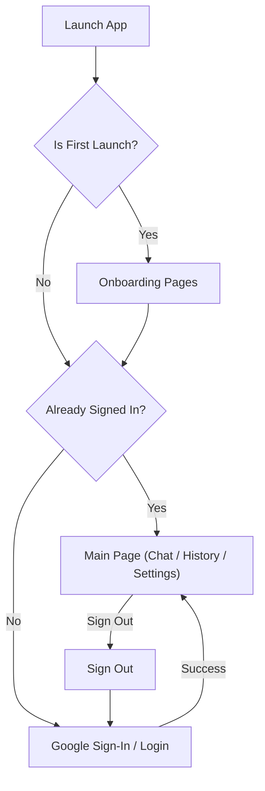

```mermaid
flowchart TD
    A[Launch App]
    B{Is First Launch?}
    C{Already Signed In?}
    D[Onboarding Pages]
    E[Google Sign-In / Login]
    F["Main Page (Chat / History / Settings)"]
    G[Sign Out]

    A --> B
    B -->|Yes| D
    B -->|No| C
    D --> C
    C -->|Yes| F
    C -->|No| E
    E -->|Success| F
    F -->|Sign Out| G --> E
```

### Todo

- [ ] Work on Models
  - [ ] AI, TTS, Video

### In Progress

- [ ] Work on the buttons

### Done ✓

- [x] Google Sign-in
