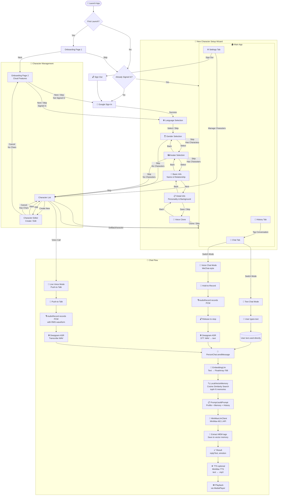
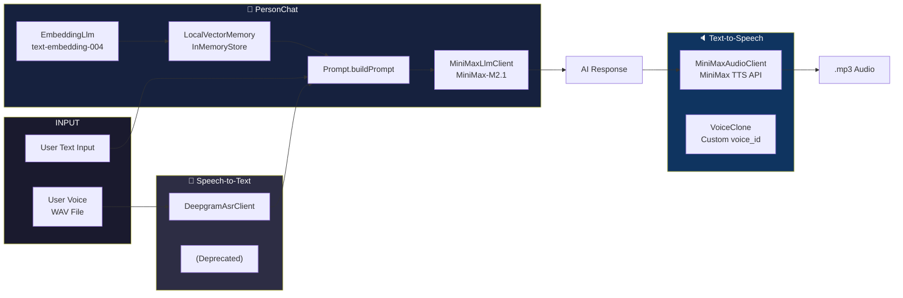

### Architecture: AI Pipeline

### Todo

- [ ] Work on Models
  - [ ] AI, TTS, Video

### In Progress

- [ ] Manage memory

### Done ✓

- [x] Google Sign-in
- [x] Clone Voice 
- [x] Delete Voice
- [ ] Data segregation for different accounts
