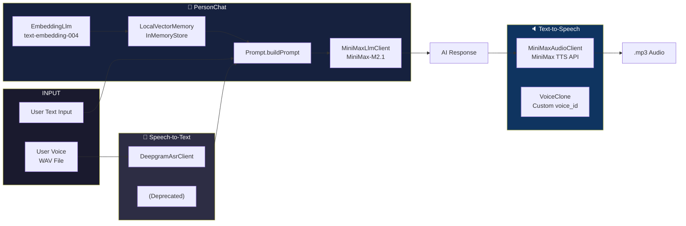

```mermaid
flowchart TD
    A([🚀 Launch App]) --> B{First Launch?}

    B -->|Yes| OB1[Onboarding Page 1]
    B -->|No| C{Already Signed In?}

    OB1 -->|Next| OB2[Onboarding Page 2\nCloud Features]
    OB1 -->|Skip| C

    OB2 -->|Next / Skip\nSigned In| LANG
    OB2 -->|Next / Skip\nNot Signed In| LOGIN

    C -->|Yes| MAIN
    C -->|No| LOGIN

    LOGIN[🔐 Google Sign-In] -->|Success| LANG

    subgraph NEW_CHARACTER_WIZARD [🧙 New Character Setup Wizard]
        LANG[🌐 Language Selection]
        GENDER[⚧ Gender Selection]
        AVATAR[🖼️ Avatar Selection]
        BASIC[📝 Basic Info\nName & Relationship]
        DETAIL[📋 Detail Info\nPersonality & Background]
        VOICE[🎤 Voice Clone]

        LANG -->|Select / Skip| GENDER
        GENDER -->|Select| AVATAR
        AVATAR -->|Select| BASIC
        AVATAR -->|Back| GENDER
        BASIC -->|Next| DETAIL
        BASIC -->|Back| AVATAR
        DETAIL -->|Save / Skip| VOICE
        DETAIL -->|Back| BASIC
        VOICE -->|Clone / Skip| MAIN
        VOICE -->|Back| DETAIL
    end

    GENDER -->|Skip\nHas Characters| MAIN
    GENDER -->|Skip\nNo Characters| CHAR_LIST
    AVATAR -->|Skip\nHas Characters| MAIN
    AVATAR -->|Skip\nNo Characters| CHAR_LIST
    BASIC -->|Skip| CHAR_LIST

    subgraph MAIN [🏠 Main App]
        direction LR
        CHAT[💬 Chat Tab]
        HISTORY[📜 History Tab]
        SETTINGS[⚙️ Settings Tab]
    end

    HISTORY -->|Tap Conversation| CHAT
    SETTINGS -->|Manage Characters| CHAR_LIST
    SETTINGS -->|Sign Out| SIGNOUT[🔓 Sign Out] --> LOGIN

    subgraph CHAR_MGMT [👥 Character Management]
        CHAR_LIST[Character List]
        CHAR_EDITOR[Character Editor\nCreate / Edit]

        CHAR_LIST -->|Create New| CHAR_EDITOR
        CHAR_LIST -->|Edit| CHAR_EDITOR
        CHAR_EDITOR -->|Save| CHAR_LIST
        CHAR_EDITOR -->|Cancel\nHas Chars| CHAR_LIST
        CHAR_EDITOR -->|Cancel\nNo Chars| OB2
    end

    CHAR_LIST -->|Select Character| MAIN
    CHAR_LIST -->|Back| MAIN

    subgraph CHAT_FLOW [💬 Chat Flow]
        direction TB
        TEXT_CHAT[💬 Text Chat Mode]
        VOICE_CHAT[🎤 Voice Chat Mode\nWeChat-style]
        LIVE_VOICE[🔮 Live Voice Mode\nPush-to-Talk]

        TEXT_CHAT --> TEXT_INPUT[📝 User types text]
        TEXT_INPUT --> STT_PASS[(User text used directly)]
        STT_PASS --> PERSONCHAT[🧠 PersonChat.sendMessage]

        VOICE_CHAT --> HOLD_MIC[🔘 Hold-to-Record]
        HOLD_MIC --> RECORD_AUDIO[🎙️ AudioRecord records PCM]
        RECORD_AUDIO --> STOP_RECORD[🔓 Release to stop]
        STOP_RECORD --> DEEPGRAM_STT[🌐 Deepgram ASR\nSTT: WAV → text]
        DEEPGRAM_STT --> PERSONCHAT

        LIVE_VOICE --> PUSH_MIC[🔘 Push-to-Talk]
        PUSH_MIC --> LIVE_RECORD[🎙️ AudioRecord records PCM\nwith RMS waveform]
        LIVE_RECORD --> LIVE_STT[🌐 Deepgram ASR\nTranscribe WAV]
        LIVE_STT --> PERSONCHAT

        PERSONCHAT --> EMBED_QUERY[🔢 EmbeddingLlm\nText → FloatArray[768]]
        EMBED_QUERY --> VECTOR_SEARCH[🔍 LocalVectorMemory\nCosine Similarity Search\ntopK=5 memories]
        VECTOR_SEARCH --> BUILD_PROMPT[📋 Prompt.buildPrompt\nProfile + Memory + History]
        BUILD_PROMPT --> LLM_REPLY[🤖 MiniMaxLlmClient\nMiniMax-M2.1 API]
        LLM_REPLY --> EXTRACT_MEM[💾 Extract [MEM:...] tags\nSave to vector memory]
        EXTRACT_MEM --> RETURN_RESULT[✅ Result{replyText, emotion}]

        RETURN_RESULT --> TTS_TEXT[🔈 TTS optional\nMiniMax TTS\ntext → .mp3]
        TTS_TEXT --> VOICE_OUTPUT[🔊 Playback\nvia MediaPlayer]
    end

    CHAT -->|Switch Mode| TEXT_CHAT
    CHAT -->|Switch Mode| VOICE_CHAT
    CHAR_LIST -->|Voice Call| LIVE_VOICE
```

### Architecture: AI Pipeline



### Todo

- [ ] Work on Models
  - [ ] AI, TTS, Video

### In Progress

- [ ] Manage memory

### Done ✓

- [x] Google Sign-in
- [x] Clone Voice 
- [x] Delete Voice
- [ ] Data segregation for different accounts
