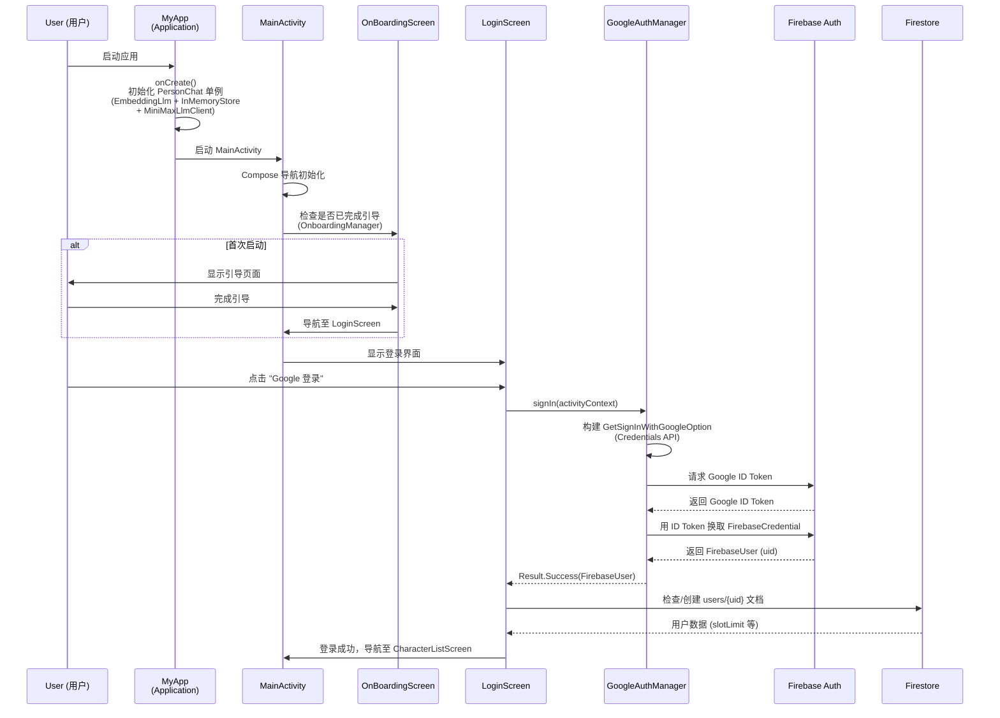
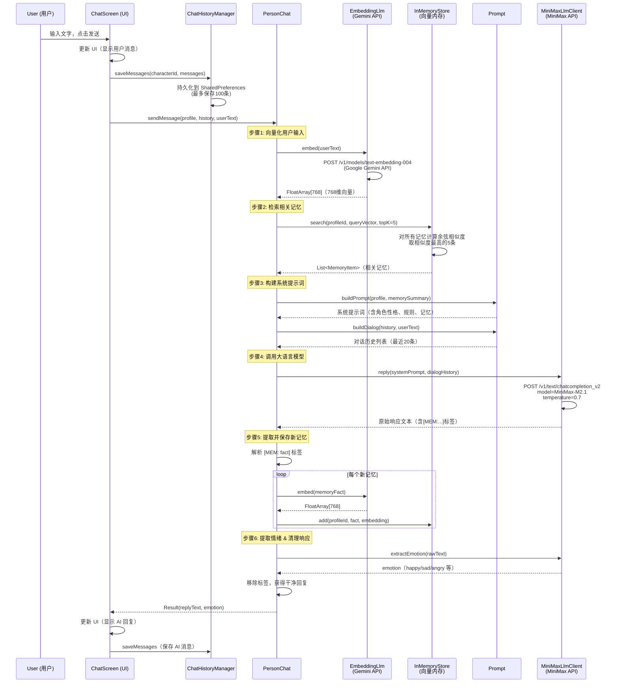
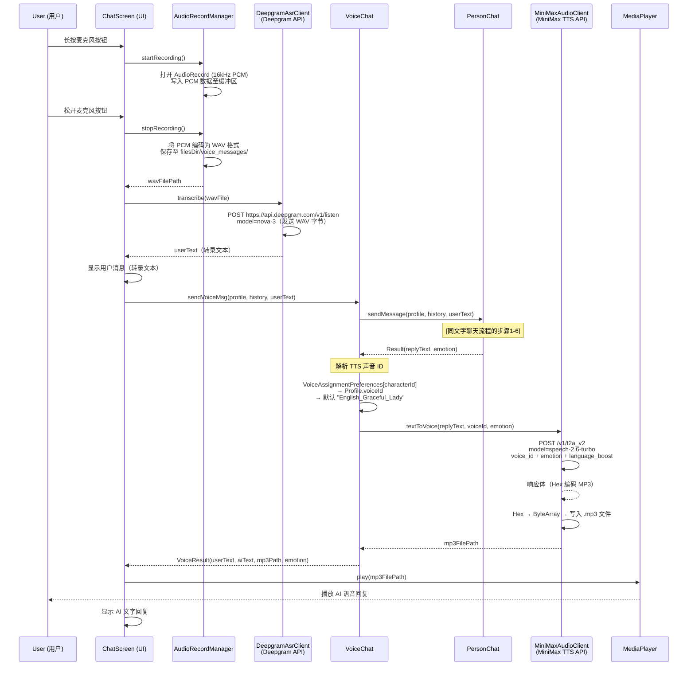
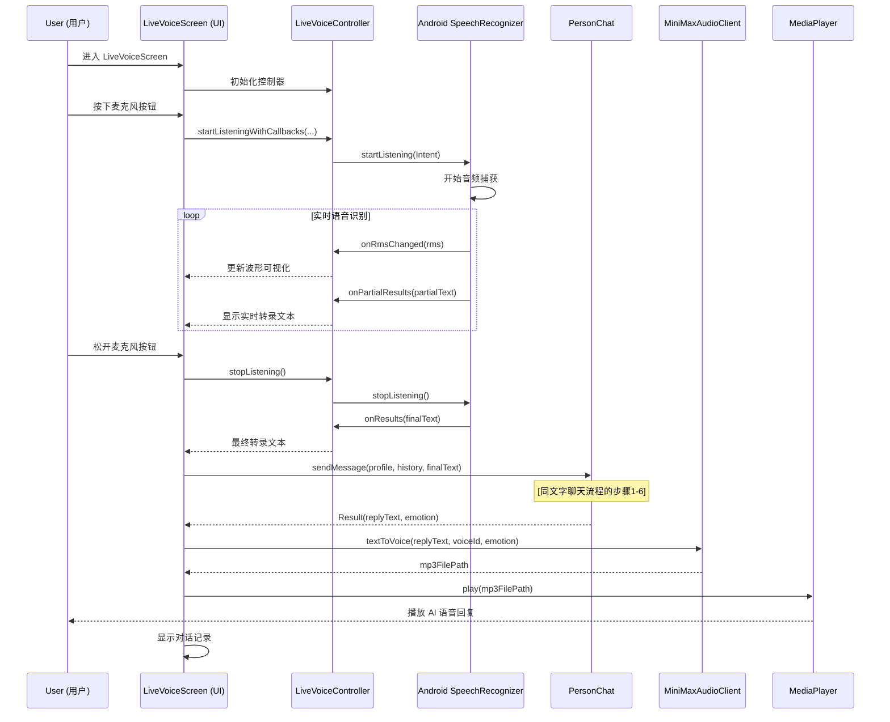
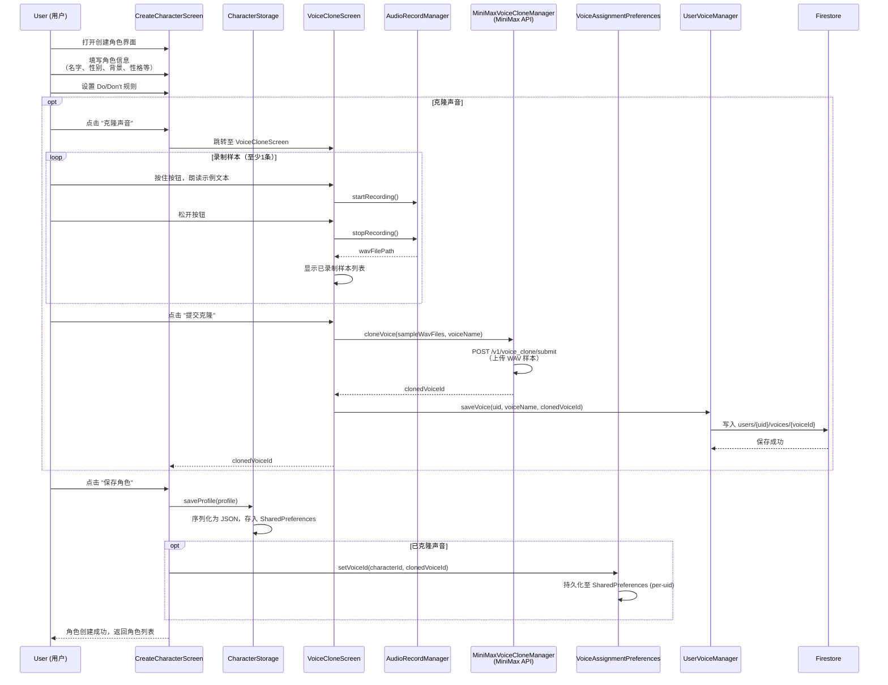
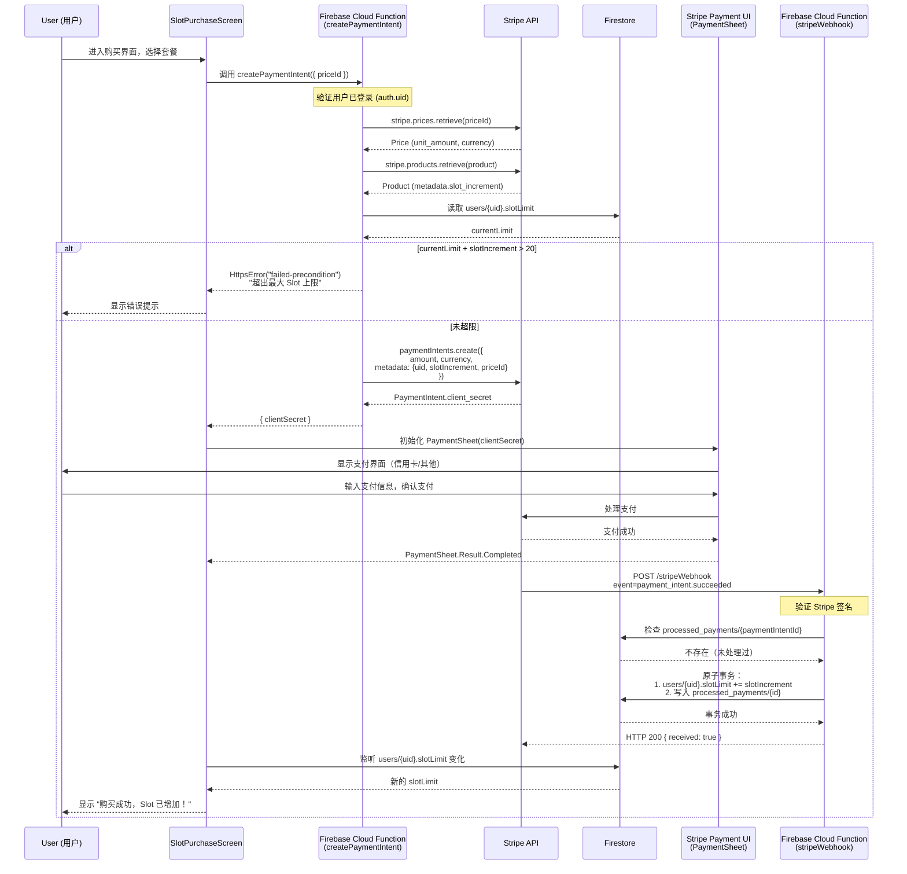
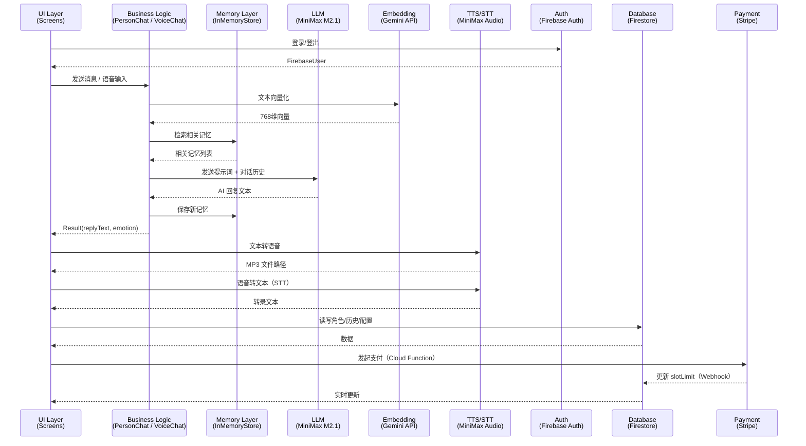

# 时序图 / Sequence Diagrams

本文档描述了 DTI5175 AI 伴侣 Android 应用中各主要功能的完整时序关系。

> 图表使用 [Mermaid](https://mermaid.js.org/) 语法，可在 GitHub、VS Code 等平台直接渲染。

---

## 目录

1. [应用启动 & 用户认证](#1-应用启动--用户认证)
2. [文字聊天流程](#2-文字聊天流程)
3. [语音聊天流程（微信录音风格）](#3-语音聊天流程微信录音风格)
4. [实时语音流程（推送对讲）](#4-实时语音流程推送对讲)
5. [角色创建 & 声音克隆流程](#5-角色创建--声音克隆流程)
6. [Slot 购买流程（Stripe 支付）](#6-slot-购买流程stripe-支付)

---

## 1. 应用启动 & 用户认证

---

## 2. 文字聊天流程

---

## 3. 语音聊天流程（微信录音风格）

---

## 4. 实时语音流程（推送对讲）

---

## 5. 角色创建 & 声音克隆流程

---

## 6. Slot 购买流程（Stripe 支付）

---

## 整体组件交互概览

