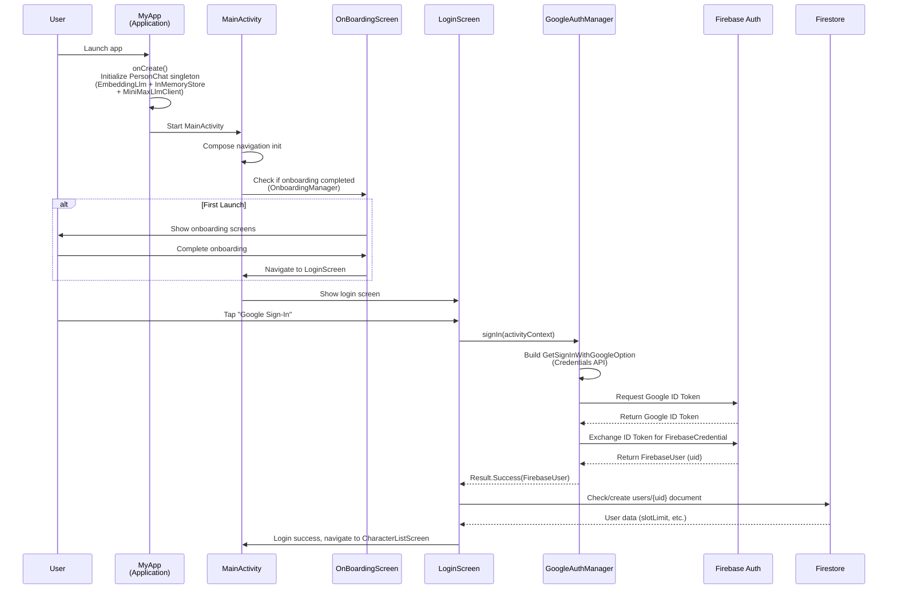
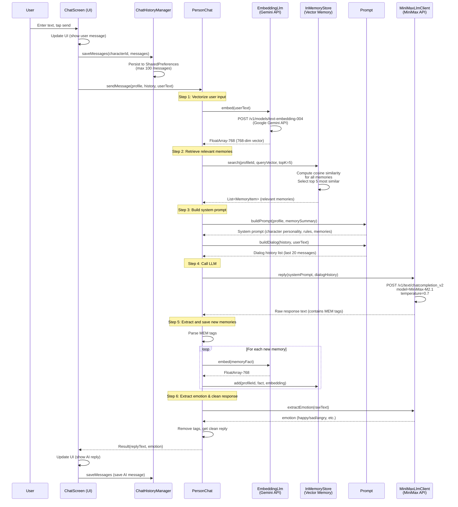
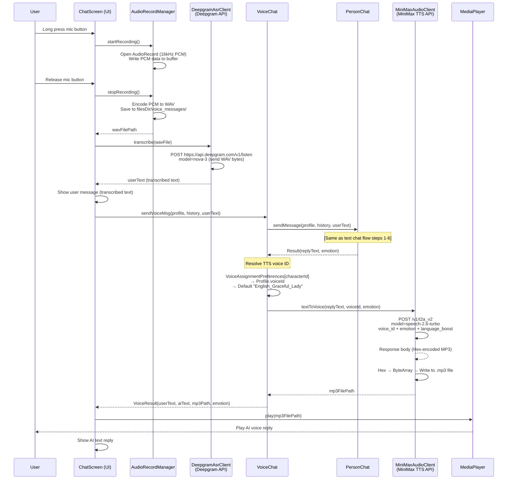
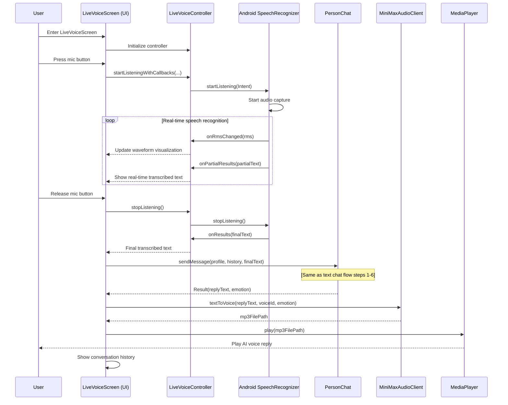
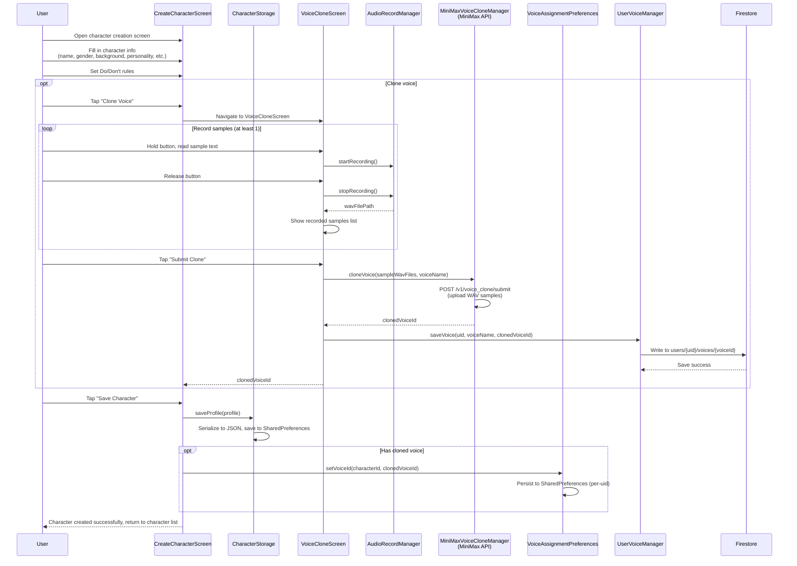
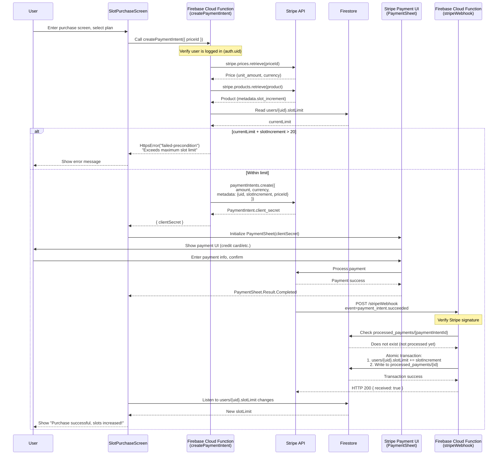
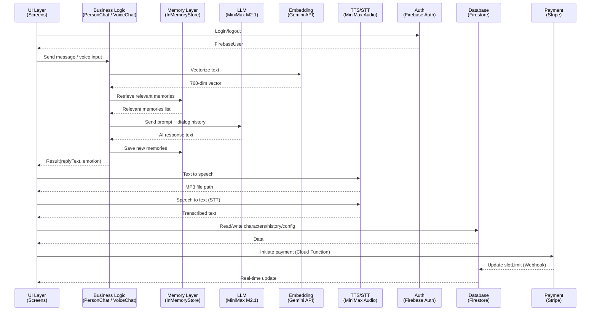

# Sequence Diagrams

This document describes the complete timing and flow of all major features in the DTI5175 AI Companion Android application.

> Diagrams use [Mermaid](https://mermaid.js.org/) syntax and can be directly rendered on GitHub, VS Code, and other platforms.

---

## Table of Contents

1. [App Launch & User Authentication](#1-app-launch--user-authentication)
2. [Text Chat Flow](#2-text-chat-flow)
3. [Voice Chat Flow (WeChat Recording Style)](#3-voice-chat-flow-wechat-recording-style)
4. [Live Voice Flow (Push-to-Talk)](#4-live-voice-flow-push-to-talk)
5. [Character Creation & Voice Cloning Flow](#5-character-creation--voice-cloning-flow)
6. [Slot Purchase Flow (Stripe Payment)](#6-slot-purchase-flow-stripe-payment)

---

## 1. App Launch & User Authentication

---

## 2. Text Chat Flow

---

## 3. Voice Chat Flow (WeChat Recording Style)

---

## 4. Live Voice Flow (Push-to-Talk)

---

## 5. Character Creation & Voice Cloning Flow

---

## 6. Slot Purchase Flow (Stripe Payment)

---

## Overall Component Interaction Overview

