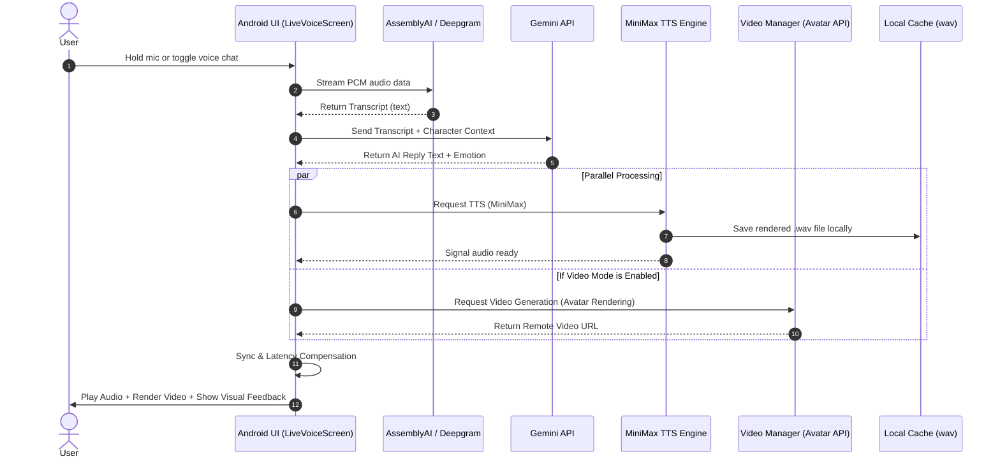
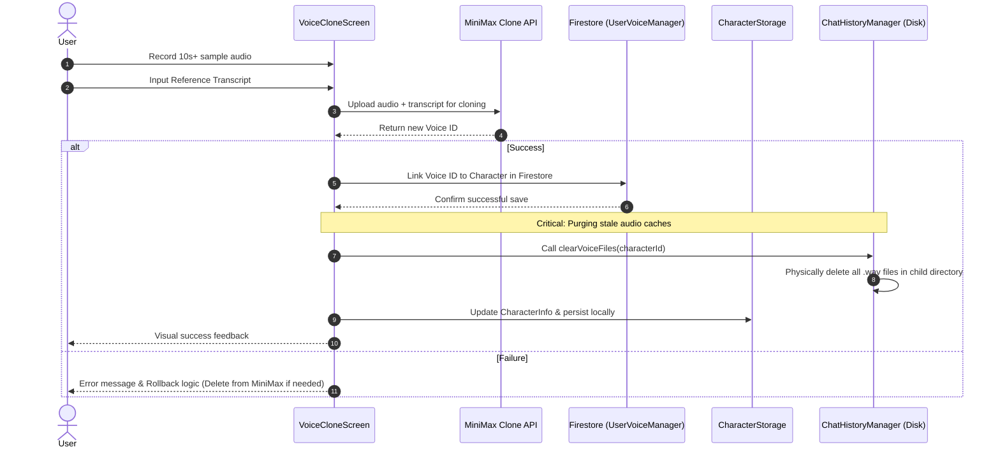
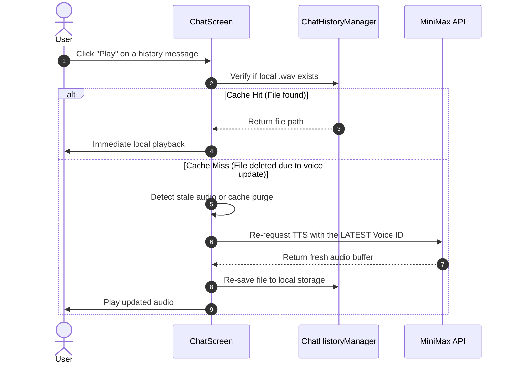
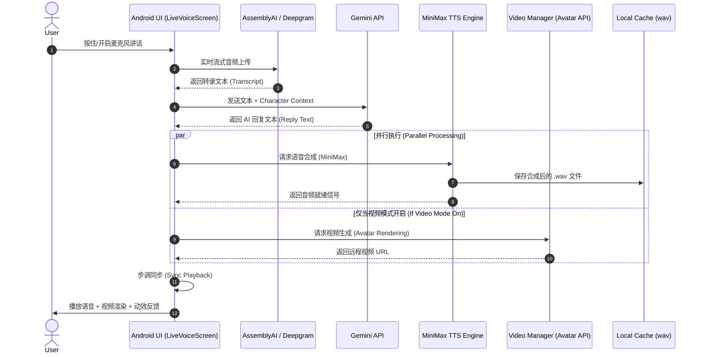
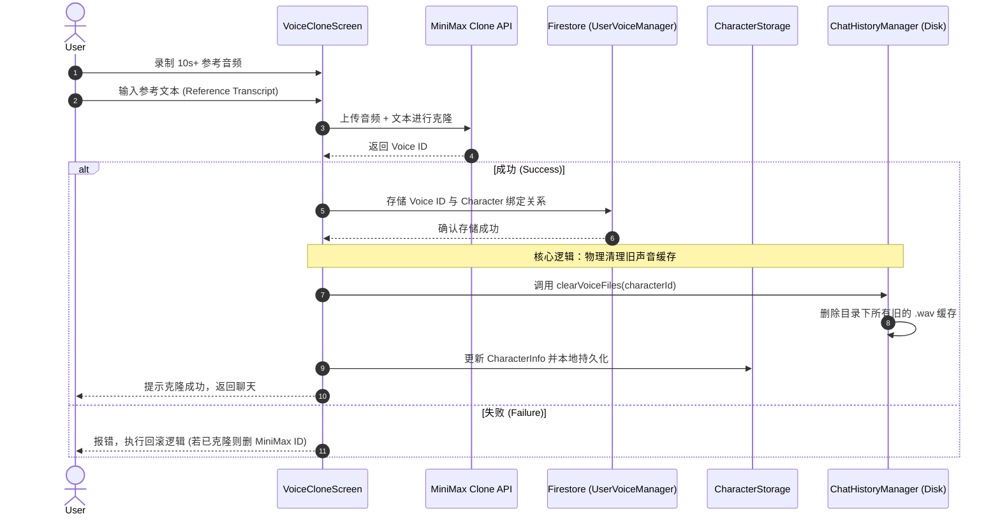
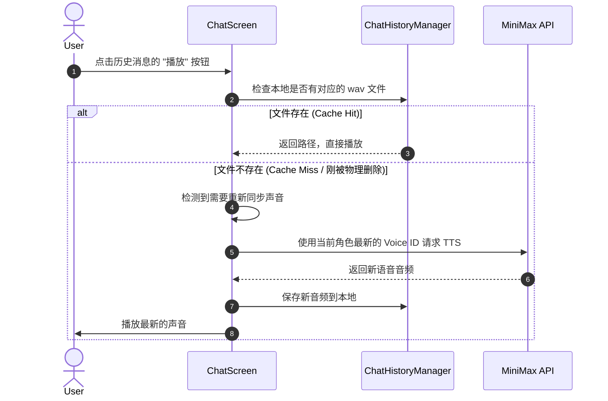

# meetsee U Technical Sequence Diagrams

This document provides a detailed breakdown of the underlying technical interactions within `meetsee U`. It visualizes the synergy between ASR, LLM, TTS, and video rendering engines.

---

### 1. Synchronized Voice & Video Interaction Flow
Describes the end-to-end path from microphone input to AI reasoning and simultaneous audio-visual playback.

---

### 2. Voice Cloning & Profile Management Flow
Details the secure voice sampling process and the critical local cache invalidation strategy.

---

### 3. On-Demand "Dynamic Refresh" Logic (Cache Invalidation)
Illustrates how the system transparently re-generates audio when a voice is updated and old files are missing.

---
> **Rendering Note**: 
> These diagrams are powered by Mermaid. 
> To view them, use a Markdown editor with Mermaid support (like VS Code or GitHub) in **Preview Mode**.

# meetsee U 技术交互时序图 (Technical Sequence Diagrams)

本文档详细描述了 `meetsee U` 核心功能的底层技术交互流程，旨在帮助开发者理解 ASR、LLM、TTS 以及视频渲染引擎之间的协作关系。

---

### 1. 实时语音视频对话流程 (Live Voice & Video Flow)
描述用户开启麦克风讲话后，系统如何从声音识别一路走到视频联动播放。

---

### 2. 声音克隆与管理流程 (Voice Cloning & Management)
描述用户录音克隆声音，并确保数据库记录与本地缓存同步清理的闭环。

---

### 3. 基于缓存失效的“动态刷新”逻辑 (Dynamic Refresh Strategy)
描述在声音 ID 更新后，系统如何通过“物理删除 -> 重新拉取”实现旧消息的无缝语音切换。

---

> **阅读建议**：
> *   本图表使用 Mermaid 渲染。
> *   如有修改需求，请直接编辑本文件的 `.md` 源码。

